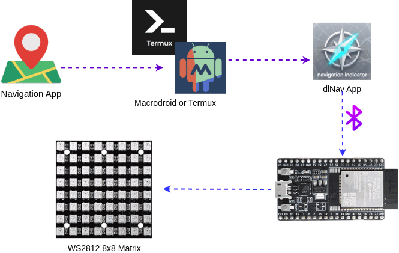
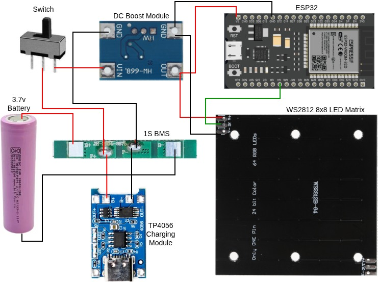

# 🧭 Automatic Navigation Indicator
Show automatic navigation indications like **left / right turn** indicator, **U-turn** indicator using your Android phone. Along with that, we can manually display some more indications like **no overtake**, **allow overtake** etc. using the buttons on our android app.

## 📽️ Demo
Demo is coming soon...

## 💡 How it works
The flow in simple words:
1. We are capturing the navigation notification from a navigation app like [OsmAnd](https://osmand.net/) using either [Termux](https://github.com/termux/termux-app) or [MacroDriod](https://www.macrodroid.com/) app. Then it sends the data (notification texts) to our [open-source dlNav app](https://github.com/daslearning-org/navigation-indicator/releases)
2. Our `dlNav` app processes the data & sends indicator signals to `ESP32` microcontroller to display that on a `WS2812B` 8x8 LED Matrix.
3. The app also has all manual controls to display the indicator symbols.

## 🧑‍💻 Quickstart Guide
Demo is coming soon...

### 🦾 ESP32 Setup
We can leverage `Classic Bluetooth` or `BLE` (low energy) to communicate from android device to ESP32.
> Note: Still working on BLE (not implemented yet)

#### 🖧 ESP32 WROOM Connection

1. All you need is to connect the `GPIO-4` of `ESP32` with the `IN` port of the `WS2812 LED Matrix` and rest all are power connections.  

#### ᛒ Classic Bluetooth
Connect your ESP32 board to your computer with a USB cable & upload [this sketch](./microControllers/esp32/bt-classic-rear.ino). If you want to learn about setting up your ESP32 environment in `Arduino IDE`, you may follow this [fantastic guide](https://randomnerdtutorials.com/installing-the-esp32-board-in-arduino-ide-windows-instructions/).

### 📱 The Android App

1. Download the [latest apk](https://github.com/daslearning-org/navigation-indicator/releases) and install.
2. Open the app & grant necessary permissions as prompted.
3. Turn on bluetooth & pair `NavIndiESP` (which is from the ESP32) device from phone settings or notification panel.
4. Use the app to list all paired devices, choose the same bluetooth name & connect it from the app. Then proceed.
5. Voila, you have now got the complete manual control of your DIY indicator device. You can press any switch to turn on/off the indicators.
6. To use the automatic indicator controls from navigation app, click on `Start Server` & proceed with next steps as below.

### 🧠 Automatic Navigation
You can choose either the macrodroid or termux way. Which will read the notifications from your navigation app & trigger an API (local) call to our android app.
> Note: Google maps or many other maps do not provice text based turn details like `turn left or make a u-turn` etc. You may choose such app which provides text based turn notifications, such as `OsmAnd`.

#### 🤖 Macrodroid way
This app is now technically a paid app (7 days trial or increase the days by viewing Ads). If you are a nerd, you may follow the Termux way.

1. Install [Macrodroid App](https://play.google.com/store/apps/details?id=com.arlosoft.macrodroid&hl=en_IN) from playstore. Grant necessary permissions. Also you need to grant `Notification read` permissions from Settings > Apps > Special app access > Notification read > allow for Macrodroid.

2. Then you can import [this macro](./macrodroid/navIndi.macro) & enable it. Now you are all set for automatic indicators as per navigation.

#### >_ Termux way
You need to follow this [termux guide](./termux/README.md) which will start the automatic notification reading & calling the api of our app.

> Note: The navigation app may have some delay in showing the notifications (app may show the correct navigation) which will also delay in indictor changes.

## 🤝 Contributing to this project
I would really love to get more contributors on this project.  

I know many improvements can be done & also limitations can be minimized. Few of them are given below.
1. Directly read notifications from our app (skipping the macrodroid & termux completely): This is really difficult from Python based android app (Kivy), someone with Java/Kotlin knowledge can help here.
2. The micro-controller: other variants can be added & code improvement can also be done.
