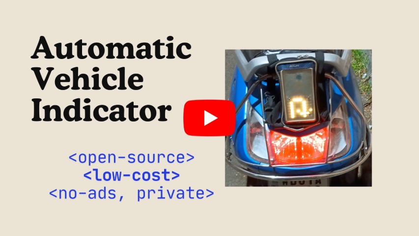

# 🧭 Automatic Navigation Indicator
Show automatic navigation indications like **left / right turn** indicator, **U-turn** indicator using your Android phone. Along with that, we can manually display some more indications like **no overtake**, **allow overtake** etc. using the buttons on our android app.

> Note: App reads notification data to have automatic indicator light. Rest assured that, our app does not collect & send any data to anywhere. Enjoy the privacy & freedom (open-source).

## 📽️ Demo
You can click on the below Image or this [Youtube Link](https://www.youtube.com/watch?v=UGAxZFuZRtc) to see the demo. Please let me know in the comments, how do you feel about this App. <br>
[](https://www.youtube.com/watch?v=UGAxZFuZRtc)

## 💡 How it works
The flow in simple words:

1. We are capturing the navigation notification from a navigation app like Google-Maps or [OsmAnd](https://osmand.net/).

2. Our `dlNav` app processes the data & sends indicator signals to `ESP32` microcontroller to display that on a `WS2812B` 8x8 LED Matrix.

3. The app also has all manual controls to display the indicator symbols.

> Note: Our app also provides an API endpoint & you can send data using [Termux](https://github.com/termux/termux-app) or [MacroDriod](https://www.macrodroid.com/) app. Then our app can process the data (notification texts) & turn on/off indicators.


## 🧑‍💻 Quickstart Guide
Follow this Quick Guide to setup your DIY navigation indicator (automatic or manual).
If wish to get the purchase links & more details, check the [official blog](https://blog.daslearning.in/microcontroller/esp32/automatic-vehicle-indicator.html)

### 🦾 ESP32 Setup
We can leverage `Classic Bluetooth` or `BLE` (low energy) to communicate from android device to ESP32.
> Note: Still working on BLE (not implemented yet)

#### 🖧 ESP32 WROOM Connection

1. All you need is to connect the `GPIO-4` of `ESP32` with the `IN` port of the `WS2812 LED Matrix` and rest all are power connections. <br>


#### ᛒ Classic Bluetooth
Connect your ESP32 board to your computer with a USB cable & upload [this sketch](./microControllers/esp32/bt-classic-rear.ino). If you want to learn about setting up your ESP32 environment in `Arduino IDE`, you may follow this [fantastic guide](https://randomnerdtutorials.com/installing-the-esp32-board-in-arduino-ide-windows-instructions/).

### 📱 Automatic Indicator using the Android App (Can work independently)

1. Download the [latest apk](https://github.com/daslearning-org/navigation-indicator/releases) and install.

2. Open the app & grant necessary permissions as prompted. If you want to use this in `Auto Mode`, you need to grant `Notification read` permission for our `dlNav` app from `Setting` > `Apps` > `Special app access`.

3. Turn on bluetooth & pair `NavIndiESP` (which is from the ESP32) device from phone settings or notification panel.

4. Use the app to list all paired devices, choose the same bluetooth name & connect it from the app. Then proceed. You may manually enter the `MAC` address of your ESP too.

5. Voila, you have now got the complete manual control of your DIY indicator device. You can press any switch to turn on/off the indicators.

6. Our app can read `Notifications` from apps like `Google Maps`, `OsmAnd`, `Offline Map Navigation` from VirtualMaze and show the automatic indicator lights. Just start the `Auto Mode`. (Notification read permission needed).

7. To use the automatic indicator controls from `MacroDroid` or `Termux`, click on `Start Server` & proceed with next steps as below. (Then our app doesn't need notification or location access)

> Note: Android Play Protect may block this app as it requires the special permission (notification read), if you do not wish to proceed, you can download the older version `0.0.3` which works with Macrodroid or Termux as shown below (our app doesn't read notification). Rest assured, we do not collect any data from our app and the app code is open-source.

### 🧠 Automatic Navigation via Termux or Macrodroid (Optional)
You can choose either the macrodroid or termux way. Which will read the notifications from your navigation app & trigger an API (local) call to our android app.

#### 🤖 Macrodroid way
This app is now technically a paid app (7 days trial or increase the days by viewing Ads). If you are a nerd, you may follow the Termux way.

1. Install [Macrodroid App](https://play.google.com/store/apps/details?id=com.arlosoft.macrodroid&hl=en_IN) from playstore. Grant necessary permissions. Also you need to grant `Notification read` permissions from Settings > Apps > Special app access > Notification read > allow for Macrodroid.

2. Then you can import [this macro](./macrodroid/navIndi.macro) & enable it. Now you are all set for automatic indicators as per navigation.

#### >_ Termux way
You need to follow this [termux guide](./termux/README.md) which will start the automatic notification reading & calling the api of our app.

> Note: The navigation app may have some delay in showing the notifications (app may show the correct navigation) which will also delay in indictor changes.

### (Optional) API Docs (for sending navigation data using API)
Once you click `Start Server` on our app, it starts `FastAPI` server & the details would be available on below URI. Just enter the URL in phone's browser and you will also get an option to try the api directly from browser.

```bash
http://localhost:8089/docs
# or
http://127.0.0.1:8089/docs
```

## 🤝 Contributing to this project
I would really love to get more contributors on this project. <br>
I know many improvements can be done & also limitations can be minimized. 
